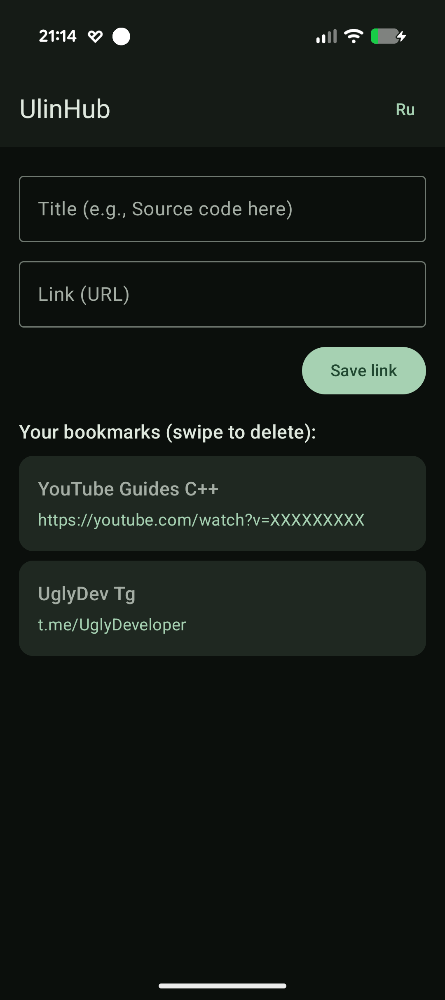
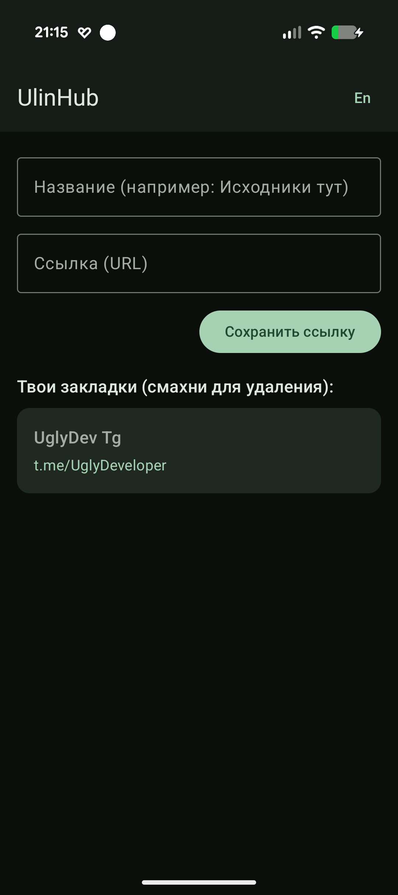
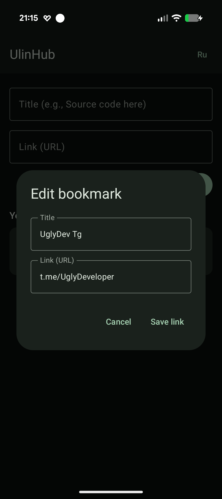
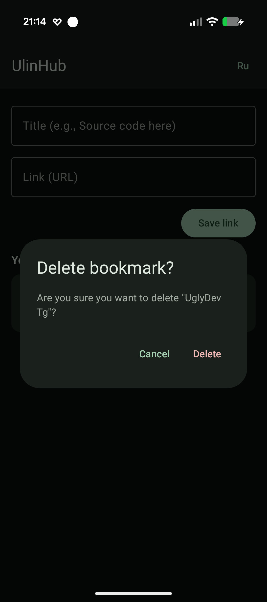

# UlinHub 🚀

[Русский](#русский) | [English](#english)

---

    
    
    
    

## English

A clean, private, and fast bookmark hub for saving links, built with **Jetpack Compose** and featuring full **Material You** design support.

### ✨ Features
- **Material You (Dynamic Colors):** The app's interface automatically adapts to your smartphone's wallpaper palette (Android 12+).
- **Local Storage:** All data is saved directly on the device using an SQLite database — completely private and works offline.
- **System Integration (Share Intent):** Select UlinHub from the system "Share" menu in any browser to quickly save your links on the fly.
- **Intuitive Gestures:** Smooth swipe-left-to-delete (Swipe-to-Dismiss) action with animated backgrounds and scales.
- **Data Safety:** Built-in protection against accidental deletions via a confirmation dialog box.
- **Bookmark Editor:** Quickly edit titles or URLs with a simple long-press on any card.
- **On-the-fly Localization:** Toggle the app language (RU/EN) instantly with a single button in the TopAppBar without restarting the activity.

### 🛠 Tech Stack
- **UI:** Jetpack Compose (Material 3)
- **Language:** Kotlin
- **Database:** SQLite (SQLiteOpenHelper)
- **Architecture & Async:** State-hoisting, Coroutines (for resetting swipe states smoothly), AppCompatDelegate for dynamic application locales.

---

## Русский

Красивый, приватный и быстрый хаб для хранения закладок и ссылок, написанный на **Jetpack Compose** с поддержкой дизайна **Material You**.

### ✨ Особенности
- **Material You (Dynamic Colors):** Интерфейс приложения автоматически адаптируется под цвета обоев твоего смартфона (Android 12+).
- **Локальное хранилище:** Все данные сохраняются на устройстве в базе данных SQLite — полностью приватно и без необходимости подключения к интернету.
- **Интеграция с системой (Share Intent):** Выбирай UlinHub через системное меню «Поделиться» в любом браузере, и ссылка мгновенно сохранится.
- **Интуитивные жесты:** Удаление карточек свайпом влево (Swipe-to-Dismiss) с плавной анимацией фона и иконки.
- **Безопасность данных:** Защита от случайных удалений через всплывающий диалог подтверждения.
- **Редактор закладок:** Быстрое изменение названия или URL-адреса по долгому нажатию на карточку.
- **Мультиязычность (On-the-fly Localization):** Переключение языка интерфейса (RU/EN) прямо внутри приложения одной кнопкой в верхнем баре.

### 🛠 Стек технологий
- **UI:** Jetpack Compose (Material 3)
- **Language:** Kotlin
- **Database:** SQLite (SQLiteOpenHelper)
- **Architecture & Async:** State-hoisting, Coroutines (для сброса анимации свайпа), AppCompatDelegate для динамической смены локали.
